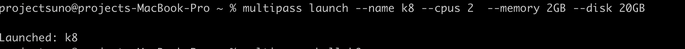
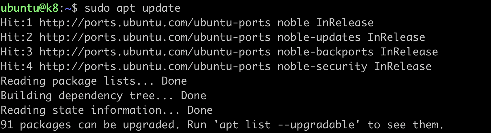
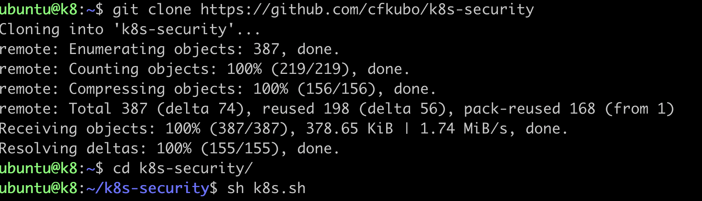
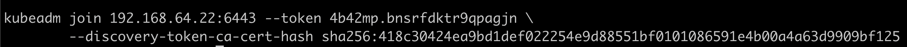
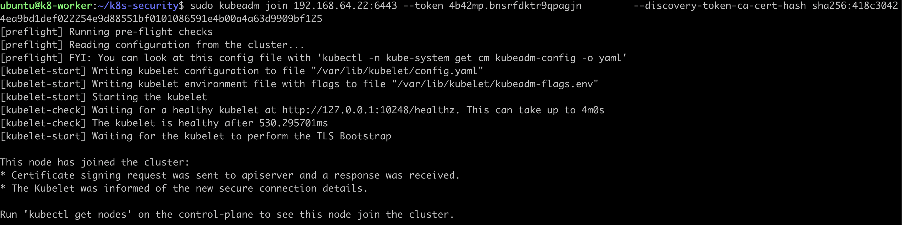
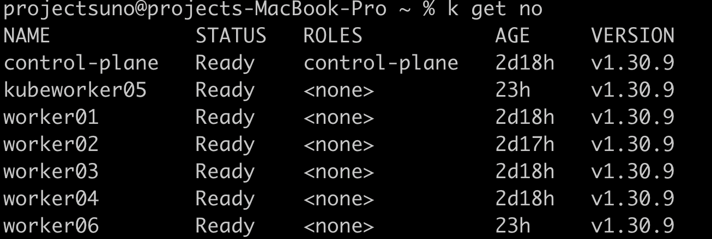

# k8s-security

## Repo to setup k8s on MAC M1 ARM
> Collection of scripts and files to setup a kubeadm k8s cluster on Ubuntu

### Option 1: setup vms with multipass on mac or ubuntu
#### MAC
> brew install multipass
#### Ubuntu
> https://ubuntu.com/server/docs/how-to-create-a-vm-with-multipass

### Option 2: Virutal Box
> https://www.virtualbox.org/wiki/Downloads

### Option 3: Download UTM
> https://mac.getutm.app/

#### Download ubuntu image form UTM gallery
> https://mac.getutm.app/gallery/

#### Download Ubuntu Desktop or Server iso
> https://ubuntu.com/download/desktop

> https://cdimage.ubuntu.com/ubuntu/releases/


# Install singlenode kubeadm k8s on MAC

#### Step 1: Setup Multipass
```
brew install multipass
```
#### Step 2: Setup vms with Multipass
```
multipass launch --name control-plane --cpus 2 --memory 2GB --disk 20GB
```
<p align="center">

</p>

#### Step 3: Setup k8s on multipass vms
> Exec shell into the vm
```
multipass shell control-plane
```
> Update apt packages
```
sudo apt update
sudo snap install go --classic
```
<p align="center">

</p>

> Clone the git repo
```
git clone https://github.com/cfkubo/k8s-security
cd k8s-security
sh k8s.sh
```
<p align="center">

</p>

# Install multinode kubeadm k8s on MAC

#### Step 1: Setup Multipass
```
brew install multipass
```
#### Step 2: Setup vms with Multipass
```
multipass launch --name control-plane --cpus 2 --memory 2GB --disk 20GB
multipass launch --name worker01 --cpus 2 --memory 2GB --disk 20GB
multipass launch --name worker02 --cpus 2  --memory 2GB --disk 20GB
```
#### Step 3: Setup k8s on multipass vms
> Exec shell into the vm
```
multipass shell control-plane
```
> Update apt packages
```
sudo apt update
sudo snap install go --classic
```
> Clone the git repo
```
git clone https://github.com/cfkubo/k8s-security
cd k8s-security
sh k8s.sh
```
<p align="center">

</p>
#### Step 4 :Copy the kubeadm join command from kubeadm init
```
cat k8s-log.txt | grep join -A 2
```
<p align="center">

</p>
#### Step 5: ssh worker node
```
multipass shell worker01
```
#### Step 6: setup k8s worker node
```
git clone https://github.com/cfkubo/k8s-security
cd k8s-security
sh k8s-worker.sh
kubeam join --token xxx # Run the join cmd you got from master node from step 4
```
<p align="center">

</p>

#### step 7: verify k8s nodes
<p align="center">

</p>
